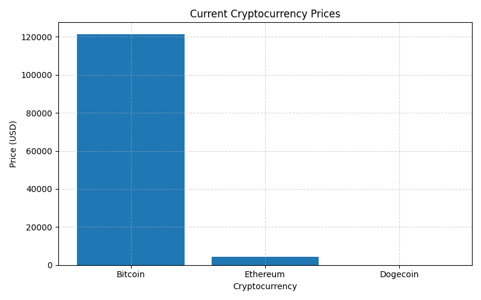

### Crypto Live Price Tracker

A Python-based real-time cryptocurrency price tracking tool that retrieves live market data from the CoinGecko API, performs data processing, generates visual insights, and exports structured results to Excel for further analysis.

## 🚀 Features

- Real-time cryptocurrency price tracking (Bitcoin, Ethereum, Dogecoin)

- Automated retrieval and parsing of JSON-based REST API data

- Clean and structured export of price data to Excel with timestamps

- Visual representation of price trends using bar charts

- Modular, readable, and beginner-friendly Python codebase

---
## 🗂️ Folder Structure

crypto-live-price-tracker/
│
├── crypto_price_tracker.py      # Main Python script
├── requirements.txt             # Dependencies list
├── sample_output.xlsx           # Example Excel export (sample data)
├── Figure_1.png                 # Visualization chart (sample output)
├── README.md                    # Project documentation
└── LICENSE                      # MIT License file (recommended)

---

### 📊 Example Output
You can also explore the full Excel report generated by this script:
🔗 [**Download sample_output.xlsx**](sample_output.xlsx.xlsx)

---

## 📸 Demo


---

## ⚡ How to Run
```bash
pip install -r requirements.txt
python scripts/crypto_price_tracker.py

---
## 🧠 Tech Stack
-Python
-Requests
-Pandas
-Matplotlib

---

## 🧠 Overview

This project automates cryptocurrency price monitoring by retrieving real-time market data for widely traded digital assets such as Bitcoin, Ethereum, and Dogecoin. It delivers immediate visual insights through charts and exports well-structured datasets to Excel, enabling efficient analysis, reporting, and data-driven decision-making.

## 📄 License

This project is distributed under the MIT License.
Refer to the LICENSE file for detailed terms and conditions.


